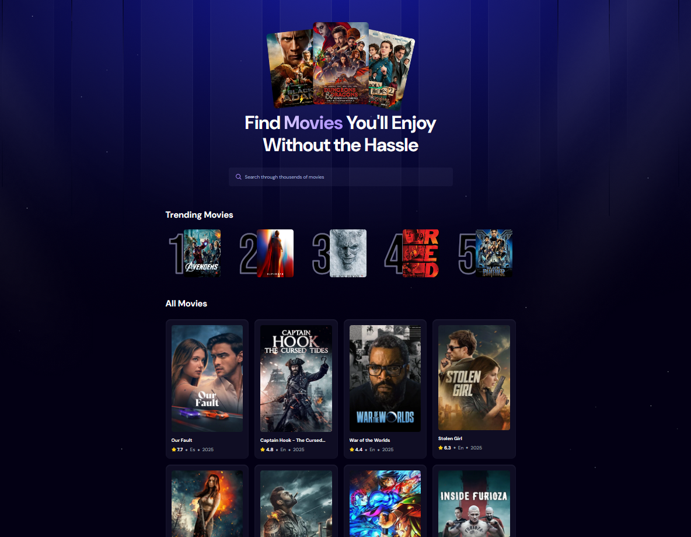

# A Movie Application

[](https://watcher.anasalhwid.com)




## 📋 <a name="table">Table of Content</a>

- ✨ [Introduction](#introduction)
- 🧩 [Features](#features)
- 💻 [Tech Stack](#tech-stack)
- ⚙️ [Getting Started](#getting-started)
- 📬 [Contact](#contact)

## <a name="introduction">✨ Introduction</a>

Welcome to the **Watcher** website. This site is thoughtfully designed to blend elegance with technology, providing the user with simplicity and fast acessibility to all of the movies. Built with a modern tech stack and refined UI/UX to enhance the interactive experience.

## <a name="features">🧩 Features</a>

📽️ **Browse All Movies** – Explore a wide range of movies available on the platform.

🔎 **Search Movies** – Easily search for specific movies using a search function.

📈 **Trending Movies Algorithm** – Displays trending movies based on a dynamic algorithm.

🎨 **Modern UI/UX** – A sleek and user-friendly interface designed for a great experience.

📱 **Responsive design** – With Tailwind CSS, it is optimized across mobile, tablet, and desktop screens.

🥷 **Blazing Fast** – SSR implementation using Node.js with Express.js, for a faster interactions.

and many more, including code architecture and reusability.

## <a name="tech-stack">💻 Tech Stack</a>

- **JavaScript**

- **[React 19](https://react.dev/)**

- **[React-use](https://github.com/streamich/react-use)**

- **[Tailwind CSS](https://tailwindcss.com/)**

- **[Vite](https://vite.dev/)**

- **[Appwrite](https://appwrite.io/)**

- **[Node.js](https://nodejs.org/en)**

- **[Express.js](https://expressjs.com/)**

## <a name="getting-started">⚙️ Getting Started</a>

> Follow these steps to set up the project locally on your machine.

### 📃 Prerequisites

- [Git](https://git-scm.com/)
- [Node.js](https://nodejs.org/en)
- [npm](https://www.npmjs.com/)

### 🛠️ Installation & Development

#### _Installation_

```bash
# Clone the repository
git clone https://github.com/AnasAlhwid/the-watcher-ssr.git

cd the-watcher-ssr    # Navigate to the directory

npm install     # Install dependencies
```

#### _Set Up Environment Variables_

Create a new file named `.env` in the root of your project and add the following content:

```env
TMDB_API_KEY=

VITE_APPWRITE_PROJECT_ID=
VITE_APPWRITE_DATABASE_ID=
VITE_APPWRITE_COLLECTION_ID=
```

Replace the placeholder values with your actual **[TMDB API](https://developer.themoviedb.org/reference/intro/getting-started)** and **[Appwrite](https://appwrite.io/)** credentials.

#### _Development_

```bash
npm run dev     # Start development server
```

Open [http://localhost:5173](http://localhost:5173/) in your browser to view the project.

### 🏗️ Production Build

```powershell
npm run build      # Builds the project

npm run preview    # Serves the production build locally
```

## <a name="contact">📬 Contact</a>

- [Email](mailto:github.reborn342@passmail.com)
- [LinkedIn](https://www.linkedin.com/in/AnasAlhwid/)
- [X ](https://x.com/AnasAlhwid)
- [GitHub](https://github.com/AnasAlhwid)
